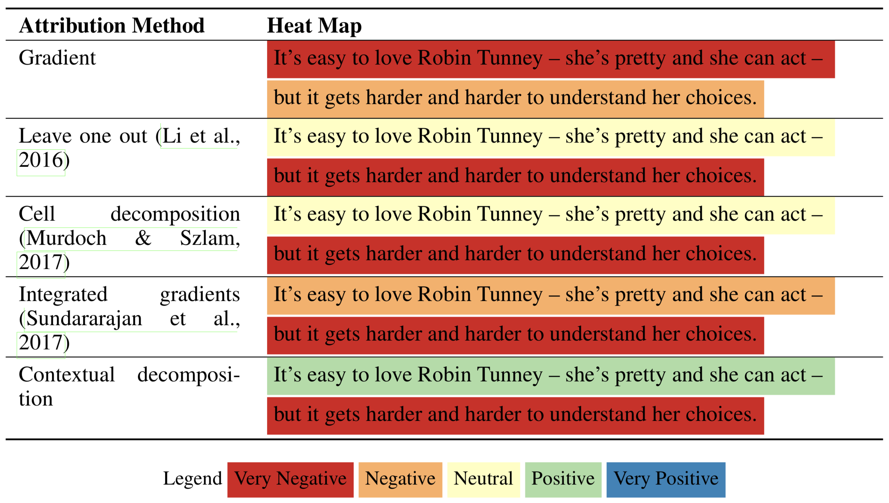

# Contextual decomposition

Demonstration of the methods introduced in "Beyond Word Importance:  Contextual Decomposition to Extract Interactions from LSTMs" ([ICLR 2018 Oral](https://arxiv.org/abs/1801.05453)) 

# Follow-up work

This repo is no longer actively maintained, but some of these related works are actively maintaining / extending the ideas here.

- ACD (ICLR 2019 [pdf](https://openreview.net/pdf?id=SkEqro0ctQ), [github](https://github.com/csinva/hierarchical-dnn-interpretations)) - extends CD to CNNs / arbitrary DNNs, and aggregates explanations into a hierarchy
- CDEP (ICML 2020 [pdf](https://arxiv.org/abs/1909.13584), [github](https://github.com/laura-rieger/deep-explanation-penalization)) - penalizes CD / ACD scores during training to make models generalize better
- TRIM (ICLR 2020 workshop [pdf](https://arxiv.org/abs/2003.01926), [github](https://github.com/csinva/transformation-importance)) - using simple reparameterizations, allows for calculating disentangled importances to transformations of the input (e.g. assigning importances to different frequencies)
- DAC (arXiv 2019 [pdf](https://arxiv.org/abs/1905.07631), [github](https://github.com/csinva/disentangled-attribution-curves)) - finds disentangled interpretations for random forests
- PDR framework (PNAS 2019 [pdf](https://arxiv.org/abs/1901.04592)) - an overarching framewwork for guiding and framing interpretable machine learning

# Reference

- feel free to use/share this code openly!
